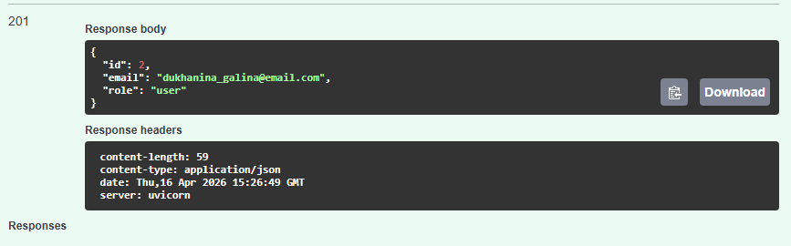
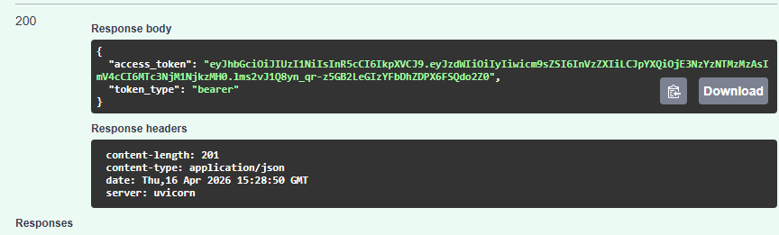
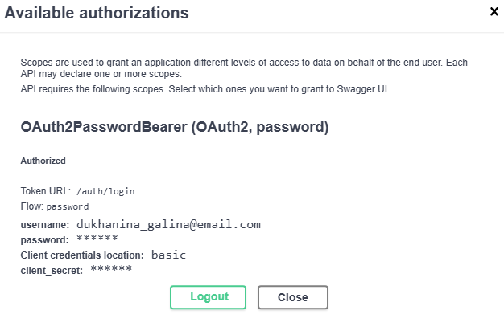
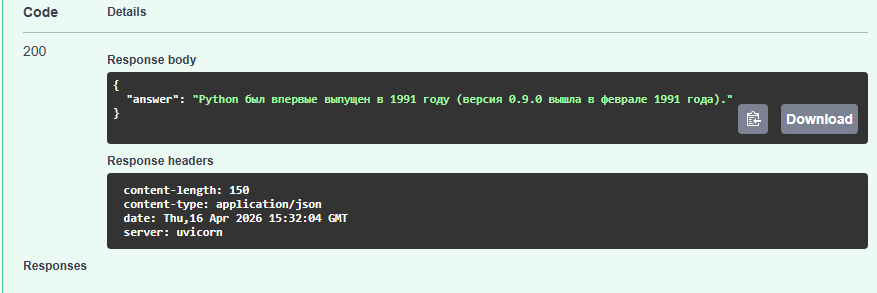
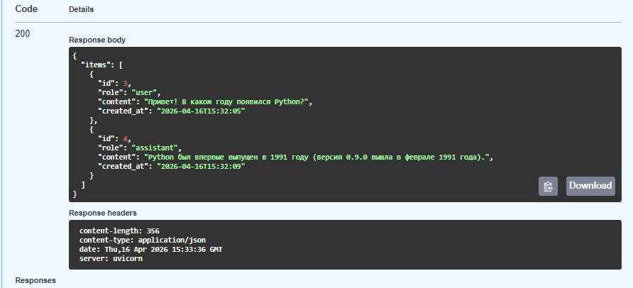
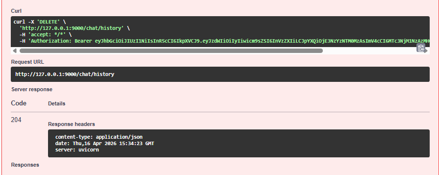
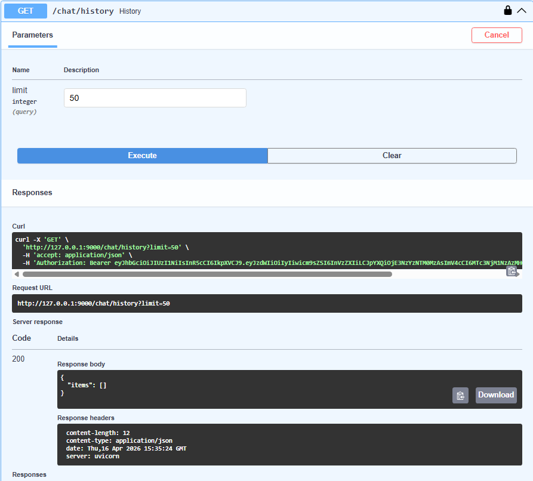

## llm-p — защищённый API для работы с LLM (OpenRouter)

Сервис на **FastAPI** с:
- **JWT-аутентификацией** (OAuth2 Password flow для Swagger)
- хранением данных в **SQLite**
- разделением слоёв: **API → UseCases → Repositories → DB/Services**
- проксированием запросов к LLM через **OpenRouter**
- историей сообщений чата в БД

---

## Требования
- Python **3.11+**
- `uv` (менеджер окружения и зависимостей)

Установка `uv`:

```bash
pip install uv
```

---

## Установка и запуск

### 1) Клонирование
```bash
git clone <URL_репозитория>
cd llm-p
```

### 2) Создание окружения и установка зависимостей
```bash
uv venv

# Windows PowerShell:
.\.venv\Scripts\activate

# Если PowerShell блокирует Activate.ps1:
# Set-ExecutionPolicy -Scope Process -ExecutionPolicy Bypass
# .\.venv\Scripts\Activate.ps1

uv pip compile pyproject.toml -o requirements.txt
uv pip install -r requirements.txt
```

### 3) Настройка переменных окружения
Создай файл `.env` в корне проекта на основе `.env.example`.

Обязательные поля:
- `JWT_SECRET`
- `OPENROUTER_API_KEY`
- `OPENROUTER_MODEL`

Пример:
```env
APP_NAME=llm-p
ENV=local

JWT_SECRET=change_me_super_secret
JWT_ALG=HS256
ACCESS_TOKEN_EXPIRE_MINUTES=60

SQLITE_PATH=./app.db

OPENROUTER_API_KEY=...
OPENROUTER_BASE_URL=https://openrouter.ai/api/v1
OPENROUTER_MODEL=nvidia/nemotron-3-super-120b-a12b:free
OPENROUTER_SITE_URL=https://example.com
OPENROUTER_APP_NAME=llm-fastapi-openrouter
```

> `.env` не коммитится (секреты). В репозитории хранится только `.env.example`.

### 4) Запуск приложения
```bash
uv run uvicorn app.main:app --reload --host 127.0.0.1 --port 9000
```

Открыть Swagger:
- `http://127.0.0.1:9000/docs`

Проверка здоровья:
- `GET http://127.0.0.1:9000/health`

> Примечание: на некоторых Windows порты 8000/8001 могут быть зарезервированы системой, поэтому используется порт **9000**.

---

## Использование API (через Swagger)

### 1) Регистрация
- `POST /auth/register`

### 2) Логин и получение токена
- `POST /auth/login` (username = email)

### 3) Авторизация в Swagger
- кнопка **Authorize** (ввод email/password)

### 4) Чат с моделью
- `POST /chat` — получить ответ LLM
- `GET /chat/history` — история сообщений
- `DELETE /chat/history` — очистка истории

---

## Линтинг
Проверка качества кода:

```bash
ruff check .
```

---

## Скриншоты работы API

Скриншоты демонстрируют использование email формата `student_surname@email.com` при регистрации.

### Регистрация пользователя (`POST /auth/register`)


### Логин и получение JWT (`POST /auth/login`)


### Авторизация в Swagger (Authorize)


### Вызов чата (`POST /chat`)


### Получение истории (`GET /chat/history`)


### Удаление истории (`DELETE /chat/history`)


### Проверка, что история очищена (`GET /chat/history`)

